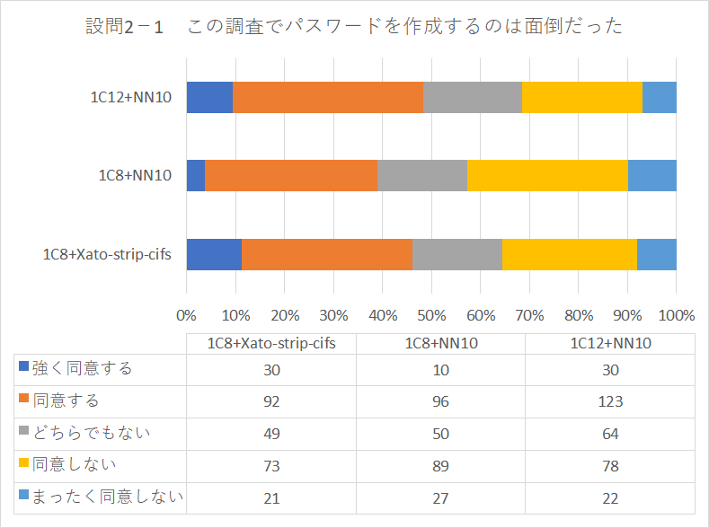
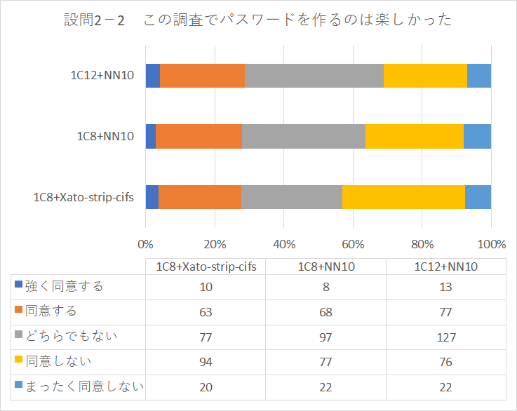
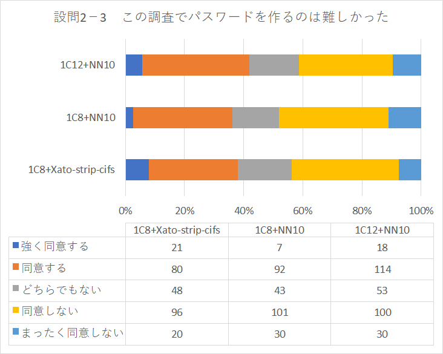

Tanらの研究＠CCS2020の追試（レプリケーション研究）
====
TanらがCCS2020で発表したパスワード強度の評価システムは従来の研究を踏まえた完成度の高い研究であった。一方で、実験は米国のユーザを対象にしたものとなっており、日本など他の国で実施した場合の効果は保証されていない。そこで本研究ではTanらの研究を追試（Replication Study）し、Tanらの結果との比較を行う。また、実施をする中で得た追試の教訓を整理し共有する

## Tanら@CCS2020での、パスワード強度向上施策のトータル評価
TanらはCCS2020において、パスワード登録時の強度向上施策（構成ポリシ、メーター、ブロックリスト）のトータルな評価を行った。これまでの関連研究では、構成ポリシやメータ等の個別の評価は行われていたがそれら技術を組み合わせた効果についてのトータルな評価は行われてこなかった。

評価の結果を踏まえTanらは「1c12+NN10」と呼ばれる構成を推奨した。

### Tanら@CCS2020における構成の表し方
1c12+NN10や、1c8+Xato-strip-ciftといったように構成の組み合わせが表現される。
それらの表現は以下の意味を持つ
- **構成要件** 「1c8」は、最低1つの文字クラス（大文字、小文字、記号、数値）を持ち、最低8文字の長さを持つ
- **最低強度要件** 「NN6」は、推測攻撃用に学習したニューラルネットワークで10^6回の試行に耐えうるパスワード強度であることを示す
- **利用ブロックリスト** 「Xato」は漏えいしたパスワードデータセットXato Corpus（1000万データ）から、4回以上出現した96,480のパスワードのリストを示す
- **照合方法** 「fs」はCaseSensitiveかつ完全一致を示す。「cifs」はCaseInsensitiveかつ完全一致を示す。「strip」は数字と記号を除いてCaseInsensitiveであることを示す。

## 追試方法
Tanらの研究における2部制のタスクのうち第1部のパスワード作成タスク」のみを実施。実施後にサーベイ（アンケート調査）を実施。

実験参加者はランサーズにおいて募集し、900人がタスクを実施。
パスワード作成タスクでは3種類のポリシ組み合わせ「1c12+N10」「1c8+NN10」「1c8+Xato-strip-cifs」をランダムに振り分けてタスクを実施。
実施期間は2022年1月10日～11日。

## 追試における日本語化
Tanらの実験に用いたシステムとサーベイ内容を日本語化して追試実験を実施した。

日本語化に関しての詳細は[日本語化](/localization_ja/)を参照。

### Tanらの実験システムの日本語化
Githubに公開されているシステム（ https://github.com/cupslab/password_meter ）を用い、表現の翻訳や文章構造の修正を行った。

### Tanらのサーベイ文言の日本語化
実験参加者への説明文書や質問子を日本語に翻訳した。

## 評価方法と結果概要

### 評価方法
タスク作成後のサーベイは5段階のLikert尺度により行われた。
ポリシ組み合わせごとに「ルール1：1c12+NN10」「ルール2：1c8+NN10」「ルール3：1c8+Xato-strip-cifs」と実験参加者集団を分け、サーベイの結果の分布差異があるかをクラスカル＝ウォリス検定で検定。有意差がある（P<0.05）と判断された場合は、2群ごとにマンホイットニーのU検定で検定し、有意差を確認。

### 評価結果概要
ここでは、満足に関連する質問項目3つについてのサーベイ結果と検定結果を示す。

他の質問項目についてのサーベイ結果は[サーベイ詳細](/survey_result/)を参照。

- **「この調査でパスワードを作成するのは面倒だった」**

    - クラスカル＝ウォリス検定の結果（P値）：有意差あり（0.004<0.05）
    - マンホイットニーのU検定の結果（P値）：ルール1とルール2間（0.0013<0.05）、ルール2とルール3間（0.019<0.5）で有意差あり

- **「この調査でパスワードを作るのは楽しかった」**

    - クラスカル＝ウォリス検定の結果（P値）：有意差なし（0.185>0.05）

- **「この調査でパスワードを作るのは難しかった」**

    - クラスカル＝ウォリス検定の結果（P値）：有意差なし（0.145>0.05）

## Publication

小沼 悠、金岡 晃：パスワード強度評価システムの追試と追試研究実施時に得た教訓、研究報告セキュリティ心理学とトラスト（SPT）,2022-SPT-48(38),1-8 (2022-07-12) , 2188-8671

## Contact

金岡 晃（東邦大学）
akira.kanaoka@is.sci.toho-u.ac.jp